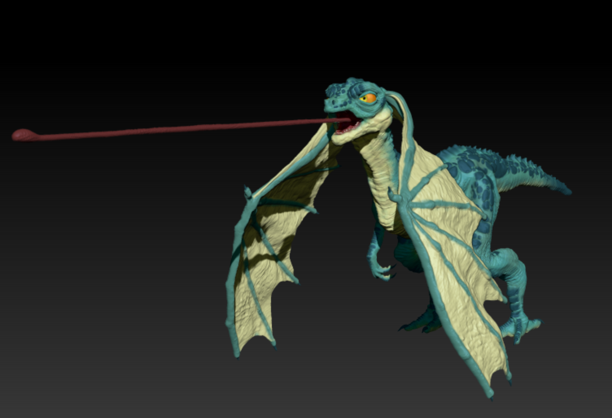
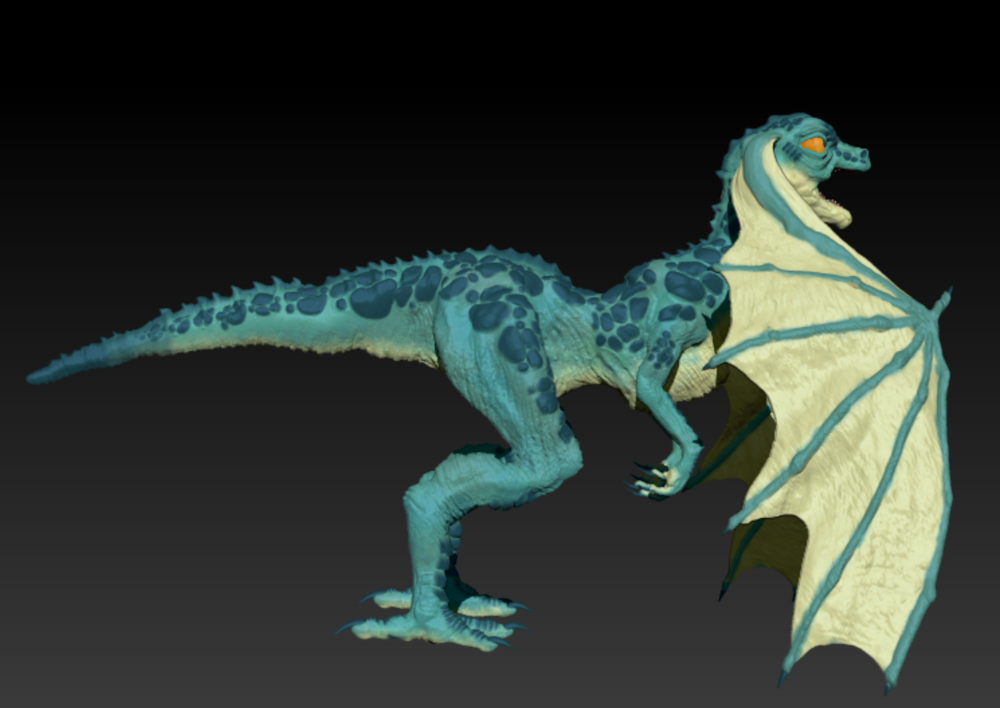
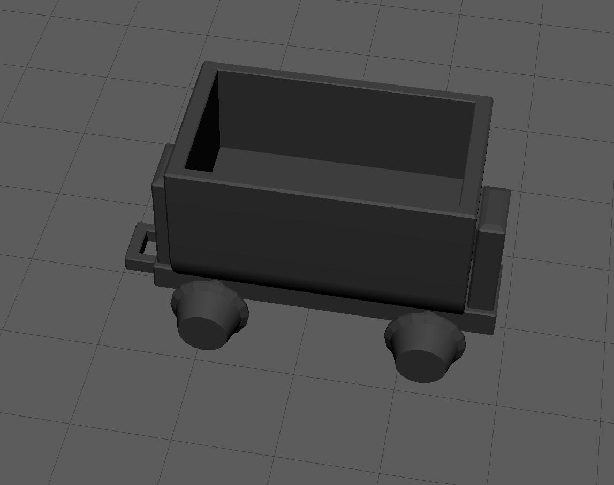
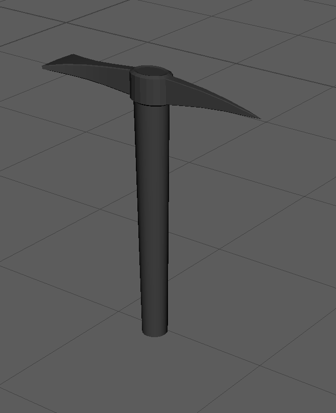
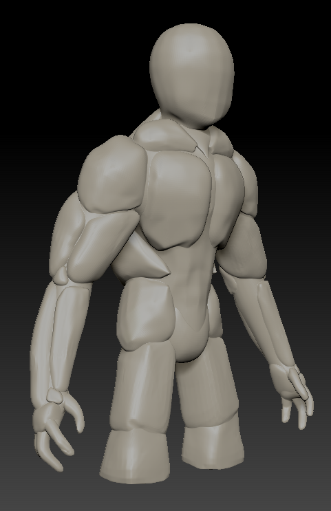
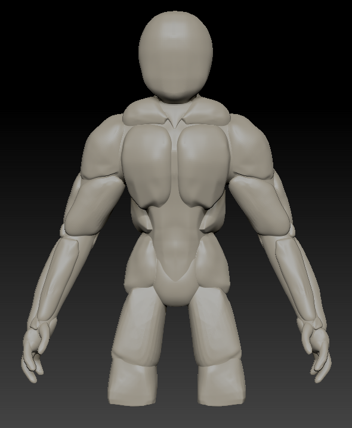

# Blog post week 2: 

## Tech team: 
The tech team subdivided the immediate basic tasks we want to get done to each member and began development. The divisions are as follows: 
James: Grappling implementation 
Niralya: Necessary basic movement & interaction/Implementing art assets
Khan: Working with the art team to implement lighting, audio and UI for the runes. 

## Art Team: 
The art team created different models for characters and interactibles for the minimum viable product of the game. 
Griffin modeled the golem, Lauren modeled the protagonist (a lizardman), and Juliet modeled some interactibles like a minecart. 

Here are some progress screenshots from the art team this week: 

